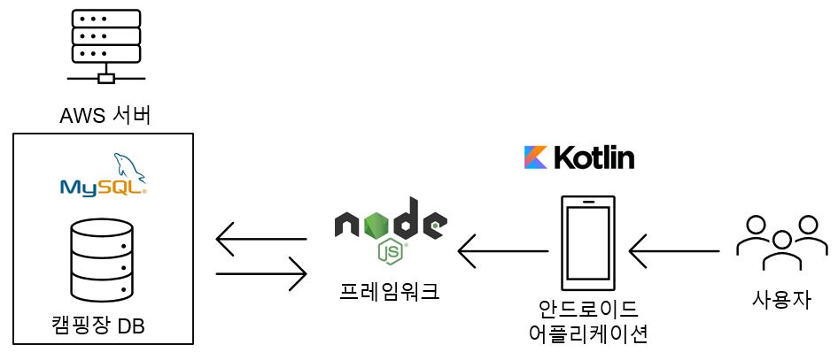

## 캠핑장 예약 관리 프로그램
### 2021 소프트웨어공학 팀프로젝트

DEPT | NAME | ROLE
---| --- | ---
CS | [윤윤호](https://github.com/yun-yunho "@Yunho Yun") | 팀장
CS | [노홍석](https://github.com/nohsa97 "@Hongseok Roh") | 팀원
CS | [이현성](https://github.com/happiestlife "@Hyunsung Lee") | 팀원
CS | [정한수](https://github.com/8471919 "@Jeong-hansu") | 팀원
CS | [최종현](https://github.com/lun4-light "@Jong-hyun Choi") | 팀원

### Implementation
---

### Collaboration tool
---
- Microsoft Teams

### Our Plan
---
<a href="https://trello.com/b/6BtFPscC/smu-nolja" target="_blank">Trello</a>

### Meeting logs
---

[2021-04-04](./%ED%9A%8C%EC%9D%98%EB%A1%9D/20210404.md)  
[2021-04-06](./%ED%9A%8C%EC%9D%98%EB%A1%9D/20210406.md)  
[2021-04-07](./%ED%9A%8C%EC%9D%98%EB%A1%9D/20210407.md)  
[2021-04-15](./%ED%9A%8C%EC%9D%98%EB%A1%9D/20210415.md)  

### 요구사항 명세서 중간보고 영상
---

  
- 위의 이미지를 클릭하시면 중간보고 영상을 시청하실 수 있습니다.
